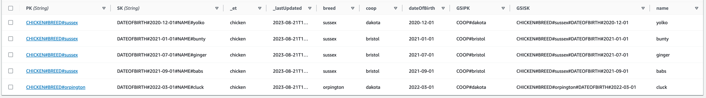

# DynamoDB Entity Store

_A lightly opinionated DynamoDB library for TypeScript & JavaScript applications_

[DynamoDB](https://aws.amazon.com/dynamodb/) is a cloud-hosted NoSQL database from AWS (Amazon Web Services).
AWS [provides an SDK](https://docs.aws.amazon.com/AWSJavaScriptSDK/v3/latest/Package/-aws-sdk-lib-dynamodb/) for using
DynamoDB from TypeScript and JavaScript applications but
it doesn't provide a particularly rich abstraction on top of
the [basic AWS HTTPS API](https://docs.aws.amazon.com/amazondynamodb/latest/APIReference/API_Operations_Amazon_DynamoDB.html).

[_DynamoDB Entity Store_](https://github.com/symphoniacloud/dynamodb-entity-store) is a library which uses the JavaScript V3 SDK from AWS and provides a _slightly_ higher level
interface to work with.
It definitely **is not** an "ORM library", and nor does it try to hide DynamoDB's fundamental behavior.
Because of this you'll still need to understand how to use DynamoDB from a modeling point of view - I strongly recommend
Alex DeBrie's [book on the subject](https://www.dynamodbbook.com/).

**WARNING!! THIS IS AN "ALPHA" VERSION!! I'm releasing an early version of this library to get feedback, but the API may well change in breaking ways over the
next weeks / months WITHOUT A CORRESPONDING MAJOR RELEASE. I hope to create a stable release by the end of October.**

**And since this is an early version I would STRONGLY APPRECIATE FEEDBACK! 😀 Please drop me an email at
mike@symphonia.io, or use the issues in this project**.

Entity Store provides the following:

* Assistance for write operations, handling repetitive aspects like configuration of table names, key attribute names,
  and setting metadata attributes like "Last Updated" time, and "TTL" (Time To Live)
* A typed interface, including parsing, for read operations (get, scans, and queries), which also provides entity-scope filtering for collection operations.
* Capability to automatically load all available results for collection operations (queries and scans), while also providing single-page versions with almost identical interfaces. 
* Simple setup when using ["Single Table Design"](https://www.alexdebrie.com/posts/dynamodb-single-table/#what-is-single-table-design) ...
* ... but also allows non-standard and/or multi-table designs
* A pretty-much-complete coverage of the entire DynamoDB API / SDK, including operations for batch and transaction
  operations, and options for diagnostic metadata (e.g. "consumed capacity")
* ... all without any runtime library dependencies, apart from official AWS DynamoDB libraries (AWS SDK V3).  

This library is named _Entity Store_ since it's based on the idea that your DynamoDB tables store one or many collections of related records, and each
collection has the same persisted structure.
Each of these collections is an _Entity_, which also corresponds to a _Domain Type_ within your application's code.

I started a first version of this library in 2022, and have used ideas here in a few projects since.
If you're deciding on what DynamoDB library to choose you may want to also consider the following alternatives:

* [DynamoDB Toolbox](https://github.com/jeremydaly/dynamodb-toolbox) - Jeremy's library was the biggest inspiration to
  my own work. When I was looking in 2022 DynamoDB Toolbox didn't support AWS SDK V3, but it does now.
* [One Table](https://github.com/sensedeep/dynamodb-onetable)

The rest of this README provides an overview of how to use the library. For more details see:
* [The manual](./documentation/manual.md)
* [integration tests](https://github.com/symphoniacloud/dynamodb-entity-store/tree/main/test/integration)
* [source code](/src/lib)
* [Type Docs](https://symphoniacloud.github.io/dynamodb-entity-store/)

## Example 1: Single Table Design, without indexes

Let's say we have the following _Domain Type_

```typescript
export interface Sheep {
  breed: string
  name: string
  ageInYears: number
}
```

And let's say we want to store these Sheep in DynamoDB like this:

| `PK`                  | `SK`          | `breed`   | `name`   | `ageInYears` |
|-----------------------|---------------|-----------|----------|--------------|
| `SHEEP#BREED#merino`  | `NAME#shaun`  | `merino`  | `shaun`  | 3            |
| `SHEEP#BREED#merino`  | `NAME#bob`    | `merino`  | `bob`    | 4            |
| `SHEEP#BREED#suffolk` | `NAME#alison` | `suffolk` | `alison` | 2            |

We are using a ["Single Table Design"](https://www.alexdebrie.com/posts/dynamodb-single-table/#what-is-single-table-design) configuration here as follows:

* The table _Partition Key_ is named `PK`
* The table _Sort Key_ is named `SK`

Now we add / install Entity Store in the usual way [from NPM](https://www.npmjs.com/package/@symphoniacloud/dynamodb-entity-store) , e.g.

```
% npm install @symphoniacloud/dynamodb-entity-store
```

Let's assume that our DynamoDB Table is named `AnimalsTable`.

We can create an entity store by using
the [`createStore`](https://symphoniacloud.github.io/dynamodb-entity-store/functions/createStore.html)
and  [`createStandardSingleTableConfig`](https://symphoniacloud.github.io/dynamodb-entity-store/functions/createStandardSingleTableConfig.html) functions:

```typescript
const entityStore = createStore(createStandardSingleTableConfig('AnimalsTable'))
```

`entityStore` is an object that implements
the [`AllEntitiesStore`](https://symphoniacloud.github.io/dynamodb-entity-store/interfaces/AllEntitiesStore.html) type.
We want to use the [`for(entity)`](https://symphoniacloud.github.io/dynamodb-entity-store/interfaces/AllEntitiesStore.html#for) method on this type, but it requires that we pass an [`Entity`](https://symphoniacloud.github.io/dynamodb-entity-store/interfaces/Entity.html) object. Here's the `Entity` implementation for `Sheep`:

```typescript
export const SHEEP_ENTITY = createEntity(
  // Type name
  'sheep',
  // Type predicate, used in standard parser
  function(x: DynamoDBValues): x is Sheep {
    const candidate = x as Sheep
    return candidate.breed !== undefined &&
      candidate.name !== undefined &&
      candidate.ageInYears !== undefined
  },
  // Generate a value for PK attribute based on a subset of fields in Sheep
  ({ breed }: Pick<Sheep, 'breed'>) => `SHEEP#BREED#${breed}`,
  // Generate a value for SK attribute based on a subset of fields in Sheep
  ({ name }: Pick<Sheep, 'name'>) => `NAME#${name}`
)
```
We only need to create this object **once per type** of entity in our application, and so you might want to define each of them as a global constant. Each entity object is responsible for:

* Defining the name of the entity type
* Expressing how to convert a DynamoDB record to a well-typed object ("parsing")
* Creating partition key and sort key values
* **Optional:** express how to convert an object to a DynamoDB record ("formatting")
* **Optional:** Create Global Secondary Index (GSI) key values

> A complete discussion of _Entities_ is available in [the manual, here](./documentation/Entities.md).

We can now call `.for(...)` on our entity store. This returns an object that implements [`SingleEntityOperations`](https://symphoniacloud.github.io/dynamodb-entity-store/interfaces/SingleEntityOperations.html) - **this is the object that you'll likely work with most when using this library**.

For example, let's store some sheep by using [`SingleEntityOperations.put`](https://symphoniacloud.github.io/dynamodb-entity-store/interfaces/SingleEntityOperations.html#put):

```typescript
const sheepOperations = entityStore.for(SHEEP_ENTITY)
await sheepOperations.put({ breed: 'merino', name: 'shaun', ageInYears: 3 })
await sheepOperations.put({ breed: 'merino', name: 'bob', ageInYears: 4 })
await sheepOperations.put({ breed: 'suffolk', name: 'alison', ageInYears: 2 })
```

Now our DynamoDB table contains the following records:

| `PK`                  | `SK`          | `breed`   | `name`   | `ageInYears` | `_et`   | `_lastUpdated`             |
|-----------------------|---------------|-----------|----------|--------------|---------|----------------------------|
| `SHEEP#BREED#merino`  | `NAME#shaun`  | `merino`  | `shaun`  | 3            | `sheep` | `2023-08-21T15:41:53.566Z` |
| `SHEEP#BREED#merino`  | `NAME#bob`    | `merino`  | `bob`    | 4            | `sheep` | `2023-08-21T15:41:53.956Z` |
| `SHEEP#BREED#suffolk` | `NAME#alison` | `suffolk` | `alison` | 2            | `sheep` | `2023-08-21T15:41:53.982Z` |

What's going on here is that Entity Store is calling `put` on the underlying DynamoDB table for each sheep. Each DynamoDB record includes all the fields on `Sheep` (don't worry, that's overridable), **along with the following extra fields**:

* `PK` - generated by calling `SHEEP_ENTITY.pk(...)` for each sheep
* `SK` - generated by calling `SHEEP_ENTITY.sk(...)` for each sheep
* `_et` - the value of `SHEEP_ENTITY.type`
* `_lastUpdated` - the current date-time

Now let's retrieve Shaun so we can find out how old he is.

```typescript
const shaun: Sheep = await sheepOperations.getOrThrow({ breed: 'merino', name: 'shaun' })
console.log(`shaun is ${shaun.ageInYears} years old`)
```

Output:

```
shaun is 3 years old
```

The underlying call to DynamoDB's `get` API needs to include both PK and SK fields. We use the same `pk()` and `sk()`
generator functions as we did for `put` to calculate these, but based on just the `breed` and `name` _identifier_ values for
a sheep.

Note that unlike the AWS SDK's `get` operation here we get a **well-typed result**. This is possible because of the
[**type-predicate function**](https://www.typescriptlang.org/docs/handbook/2/narrowing.html#using-type-predicates) that we included when creating `SHEEP_ENTITY` . Note that in this basic example we assume that the underlying DynamoDB record
attributes include all the properties on a sheep object, but it's possible to customize parsing and/or derive values
from the PK and SK fields if you want to optimize your DynamoDB table - I'll show that a little later.

We can get all of our _merino_-breed sheep by running a query against the table's Partition Key:

```typescript
const merinos: Sheep[] = await sheepOperations.queryAllByPk({ breed: 'merino' })
for (const sheep of merinos) {
  console.log(`${sheep.name} is ${sheep.ageInYears} years old`)
}
```

Output:

```
bob is 4 years old
shaun is 3 years old
```

Similar to `get` we need to provide the value for the `PK` field, and again under the covers Entity Store is
calling `pk()` on `SHEEP_ENTITY` . Since this query only filters on the `PK` attribute we only need to provide `breed`
when we call `queryAllByPk()`.

Like `getOrThrow`, the result of the query operation is a well-typed list of items - again by using the parser / type
predicate function on `SHEEP_ENTITY` .

A lot of the power of using DynamoDB comes from using the Sort Key as part of a query. Now let's find all sheep of a particular breed, but also where `name` is in a particular alphabetic range:

```typescript
function rangeWhereNameBetween(nameRangeStart: string, nameRangeEnd: string) {
  return rangeWhereSkBetween(`NAME#${nameRangeStart}`, `NAME#${nameRangeEnd}`)
}

const earlyAlphabetMerinos = await sheepOperations.queryAllByPkAndSk(
  { breed: 'merino' },
  rangeWhereNameBetween('a', 'n')
)

for (const sheep of earlyAlphabetMerinos) {
  console.log(sheep.name)
}
```

Output:

```
bob
```

To query with a Sort Key we must first specify the partition key - which here is the same as our first example - and
then must specify a sort key _query range_.
There are a few helpers in Entity Store for this - in our case we use the [`rangeWhereSkBetween`](https://symphoniacloud.github.io/dynamodb-entity-store/functions/rangeWhereSkBetween.html) helper which ends up generating the condition
expression `PK = :pk and #sk BETWEEN :from AND :to` .

## Turning on logging

When you're working on setting up your entities and queries you'll often want to see what Entity Store is actually
doing. You can do this by turning on logging:

```typescript
const config = createStandardSingleTableConfig('AnimalsTable')
const entityStore = createStore(createStandardSingleTableConfig('AnimalsTable'), { logger: consoleLogger })
```

With this turned on we can see the output from our last query:

```
DynamoDB Entity Store DEBUG - Attempting to query or scan entity sheep [{"useAllPageOperation":false,"operationParams":{"TableName":"AnimalsTable","KeyConditionExpression":"PK = :pk and #sk BETWEEN :from AND :to","ExpressionAttributeValues":{":pk":"SHEEP#BREED#merino",":from":"NAME#a",":to":"NAME#n"},"ExpressionAttributeNames":{"#sk":"SK"}}}]

DynamoDB Entity Store DEBUG - Query or scan result [{"result":{"$metadata":{"httpStatusCode":200,"requestId":"CN2O9KUEECRUJ0BTPT1DT79G6NVV4KQNSO5AEMVJF66Q9ASUAAJG","attempts":1,"totalRetryDelay":0},"Count":1,"Items":[{"_lastUpdated":"2023-08-21T19:15:37.396Z","SK":"NAME#bob","ageInYears":4,"PK":"SHEEP#BREED#merino","breed":"merino","_et":"sheep","name":"bob"}],"ScannedCount":1}}]
```

The store's `logger` can actually be anything that satisfies the [`EntityStoreLogger`](https://github.com/symphoniacloud/dynamodb-entity-store/blob/main/src/lib/util/logger.ts) type.
The library provides a silent "No-op" logger that it uses by default, as well as the [`consoleLogger`](https://symphoniacloud.github.io/dynamodb-entity-store/variables/consoleLogger.html) shown here, but you
can easily implement your own - there's an example in the [source code comments](https://github.com/symphoniacloud/dynamodb-entity-store/blob/94a622f/src/lib/util/logger.ts) of implementing a logger
for [AWS PowerTools](https://docs.powertools.aws.dev/lambda/typescript/latest/core/logger/).

## Example 2: Adding a Global Secondary Index

Another powerful feature of DynamoDB is Global Secondary Indexes, or GSIs.
The "standard configuration" helper in Entity Store assumes that you have one GSI on your table, named `GSI`, and that
the index has a partition key named `GSIPK` and a sort key named `GSISK`.
This is all completely configurable though, and you can add as many GSIs as DynamoDB supports, or none at all.

We can use a table's GSI with an entity by adding a `gsi` field to the `Entity` definition. Here's an example.

Let's say we model chickens. The domain type and associated type predicate are as follows:

```typescript
export interface Chicken {
  breed: string
  name: string
  dateOfBirth: string
  coop: string
}

export function isChicken(x: unknown): x is Chicken {
  const candidate = x as Chicken
  return (
    candidate.breed !== undefined &&
    candidate.name !== undefined &&
    candidate.dateOfBirth !== undefined &&
    candidate.coop !== undefined
  )
}
```

The Entity this time is a little more complicated:

```typescript
export const CHICKEN_ENTITY: Entity<
  Chicken,
  Pick<Chicken, 'breed'>,
  Pick<Chicken, 'name' | 'dateOfBirth'>
> = {
  type: 'chicken',
  parse: typePredicateParser(isChicken, 'chicken'),
  pk({ breed }: Pick<Chicken, 'breed'>): string {
    return `CHICKEN#BREED#${breed}`
  },
  sk({ name, dateOfBirth }: Pick<Chicken, 'name' | 'dateOfBirth'>): string {
    return `DATEOFBIRTH#${dateOfBirth}#NAME#${name}`
  },
  gsis: {
    gsi: {
      pk({ coop }: Pick<Chicken, 'coop'>): string {
        return `COOP#${coop}`
      },
      sk({ breed, dateOfBirth }: Pick<Chicken, 'breed' | 'dateOfBirth'>): string {
        return `CHICKEN#BREED#${breed}#DATEOFBIRTH#${dateOfBirth}`
      }
    }
  }
}
```

* `pk()` is very similar to sheep
* `sk()` this time includes date of birth
* `gsis.gsi` are the generator functions for our `GSI` index (the `GSI` <-> `gsi` naming mapping is overrideable)
    * `gsis.gsi.pk()` generates the GSI PK
    * `gsis.gsi.sk()` generates the GSI SK
    * Remember - a GSI, unlike a table, can include multiple records for the same PK + SK combination

Write operations are no different than before - Entity Store handles generating the GSI PK and SK fields given the
generator functions. So if we have the following...

```typescript
const entityStore = createStore(createStandardSingleTableConfig('AnimalsTable'))
const chickenStore = entityStore.for(CHICKEN_ENTITY)

await chickenStore.put({ breed: 'sussex', name: 'ginger', dateOfBirth: '2021-07-01', coop: 'bristol' })
await chickenStore.put({ breed: 'sussex', name: 'babs', dateOfBirth: '2021-09-01', coop: 'bristol' })
await chickenStore.put({ breed: 'sussex', name: 'bunty', dateOfBirth: '2021-01-01', coop: 'bristol' })
await chickenStore.put({ breed: 'sussex', name: 'yolko', dateOfBirth: '2020-12-01', coop: 'dakota' })
await chickenStore.put({ breed: 'orpington', name: 'cluck', dateOfBirth: '2022-03-01', coop: 'dakota' })
```

...then the result in DynamoDB is as follows



We can query this entity on the table PK and SK as normal, but let's skip to querying the GSI.

First we can query just on the GSI's PK:

```typescript
console.log('Chickens in Dakota:')
for (const chicken of await chickenStore.queryAllWithGsiByPk({ coop: 'dakota' })) {
  console.log(chicken.name)
}
```

Which results in:

```
Chickens in Dakota:
cluck
yolko
```

And we can also narrow down using the GSI SK values too:

```typescript
console.log('\nOrpingtons in Dakota:')
for (const chicken of await chickenStore.queryAllWithGsiByPkAndSk(
  { coop: 'dakota' },
  rangeWhereSkBeginsWith('CHICKEN#BREED#orpington')
)) {
  console.log(chicken.name)
}
```

resulting in:

```
Orpingtons in Dakota:
cluck
```

## Example 3: Custom table configuration and attribute mapping

So far I've given a couple of examples that conform to the "standard single table" model of using DynamoDB, which
involves using very generic PK and SK fields named `PK` and `SK`, using those fields for generated identifiers, and
putting all actual data on non-key attributes.

Entity Store supports other modes of usage though. Let's say we also want to store Farms, in a separate table named
FarmTable, which looks as follows:

| `Name`           | `FarmAddress`                      |
|------------------|------------------------------------|
| `Sunflower Farm` | `Green Shoots Road, Honesdale, PA` |      
| `Worthy Farm`    | `Glastonbury, England`             |

For this table the Partition Key is `Name` and there is no Sort Key. Also note in this case we've chosen **not** to
store the entity type
or last-updated values - perhaps this is an old table we're importing into our application.

Our domain code will look like this - **note that the fields on the domain object start with lower case, even though
those on the table start with upper case** . Again, this is just an example to show what's possible - mixing up
attribute names like this isn't normally a good idea!

```typescript
export interface Farm {
  name: string
  address: string
}

function isFarm(x: unknown): x is Farm {
  const candidate = x as Farm
  return candidate.name !== undefined && candidate.address !== undefined
}
```

We create the entity store using a custom configuration:

```typescript
const entityStore = createStore(
  createMinimumSingleTableConfig('FarmTable', { pk: 'Name' })
)
```

> See [_Setup_ in the manual](documentation/Setup.md) for more on custom table configuration.

The `Entity` this time is a bit more complicated:

```typescript
export const FARM_ENTITY = entityFromPkOnlyEntity({
  type: 'farm',
  pk({ name }: Pick<Farm, 'name'>): string {
    return name
  },
  convertToDynamoFormat: (item) => {
    return {
      // 'Name' is automatically added because it is the PK
      FarmAddress: item.address
    }
  },
  parse: (item: DynamoDBValues, _: string[], metaAttributeNames: MetaAttributeNames): Farm => {
    const parsed = {
      // We could just read item.Name here, but this example shows that in a custom parser we can
      // access the meta attribute names of table
      name: getPKValue(item, metaAttributeNames),
      address: item.FarmAddress
    }
    if (isFarm(parsed)) return parsed
    else throw new Error('Unable to parse DynamoDB record to Farm')
  }
})
```

There are a few things going on here:

* We're using the `entityFromPkOnlyEntity` helper method here because we're not actually using a Sort Key, and don't
  have a `sk()` method
* Even though our partition key is named differently (`Name`) we still have a `pk()` function - and this is still used
  when we both write and read data
* There's a custom formatter this time - `convertToDynamoFormat` - this is used because the attribute name for
  address (`FarmAddress`) is different to the property name on our domain object (`address`)
* Similarly there's a custom parser - `parse` - which takes the raw DynamoDB item and returns a type-checked `Farm`
  object

Now we can store and read `Farm` objects.

This...

```typescript
const farmStore = entityStore.for(FARM_ENTITY)
await farmStore.put({ name: 'Sunflower Farm', address: 'Green Shoots Road, Honesdale, PA' })
await farmStore.put({ name: 'Worthy Farm', address: 'Glastonbury, England' })
```

...results in the following being stored in DynamoDB:


Note that, because of the configuration, there aren't any meta attributes here.

Similarly we can get a farm:

```typescript
const worthyFarm = await farmStore.getOrThrow({ name: 'Worthy Farm' })
console.log(`Address of Worthy Farm: ${worthyFarm.address}`)
```

This results in:

```
Address of Worthy Farm: Glastonbury, England
```

Finally it might make sense to use `scan` on this table. Because scanning is usually a terrible idea for standard
single-table designs, by default Entity Store will throw an error if you try! E.g.:

```typescript
for (const farm of await farmStore.scanAll()) {
  console.log(`Name: ${farm.name}, Address: ${farm.address}`)
}
```

results in:

```
Error: Scan operations are disabled for this store
```

However, we can change our table configuration to be the following:

```typescript
const entityStore = createStore({
  ...createMinimumSingleTableConfig('FarmTable', { pk: 'Name' }),
  allowScans: true
})
```

and now we can run our scan:

```
All farms:
Name: Worthy Farm, Address: Glastonbury, England
Name: Sunflower Farm, Address: Green Shoots Road, Honesdale, PA
```
